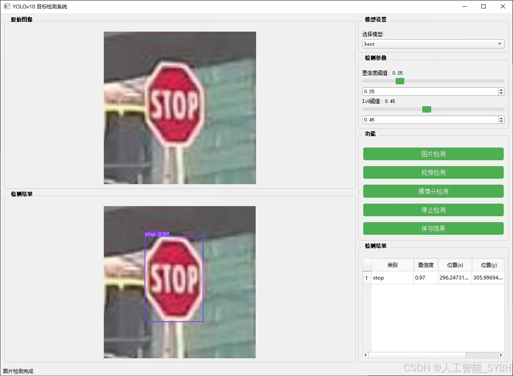
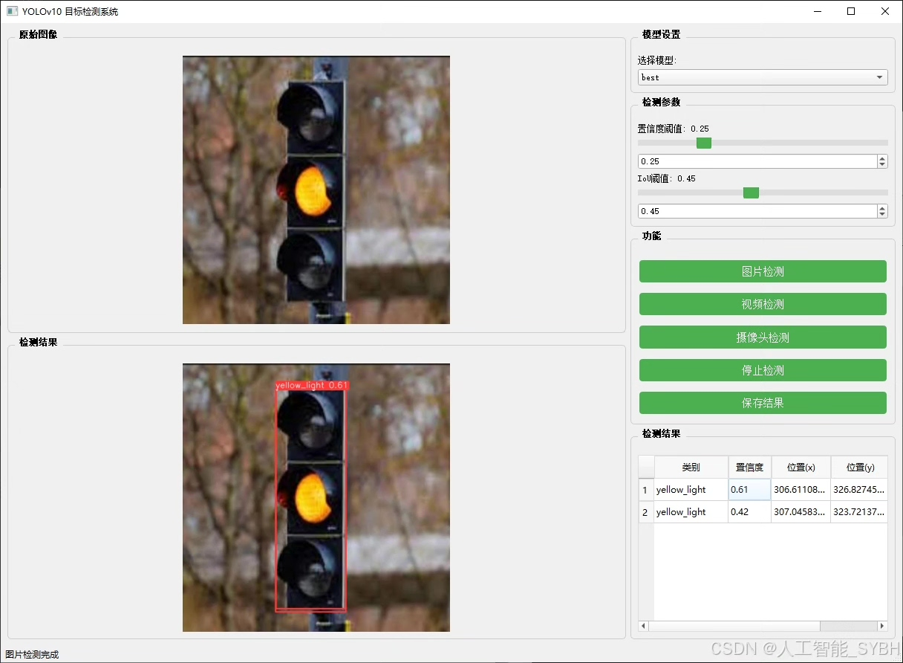
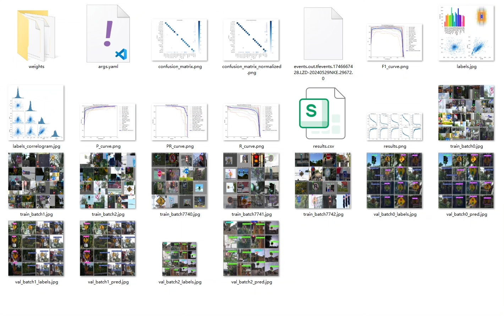
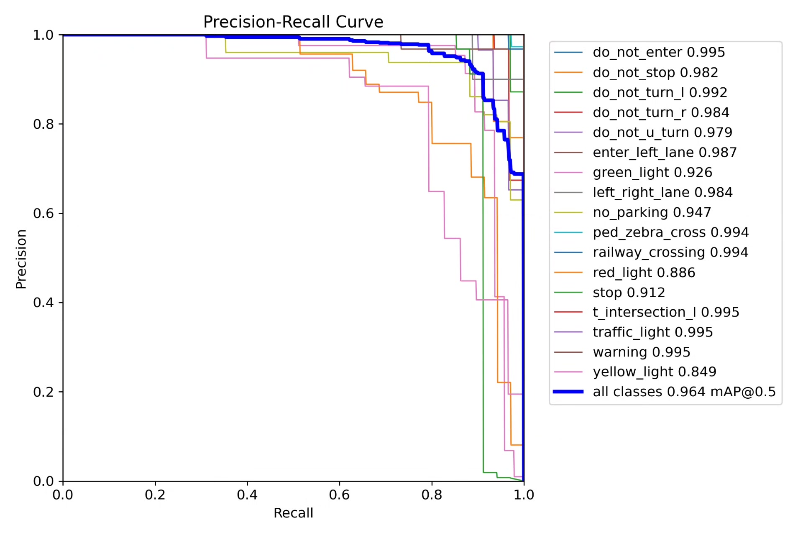
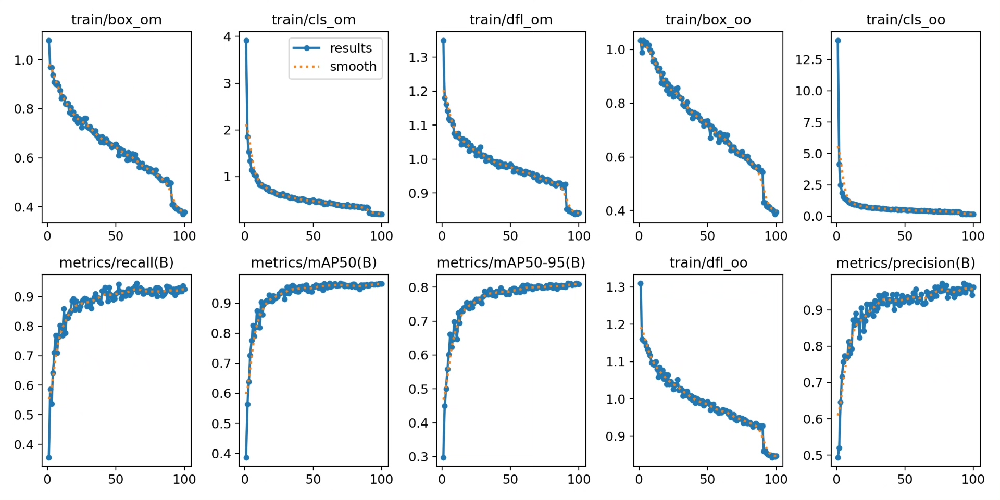
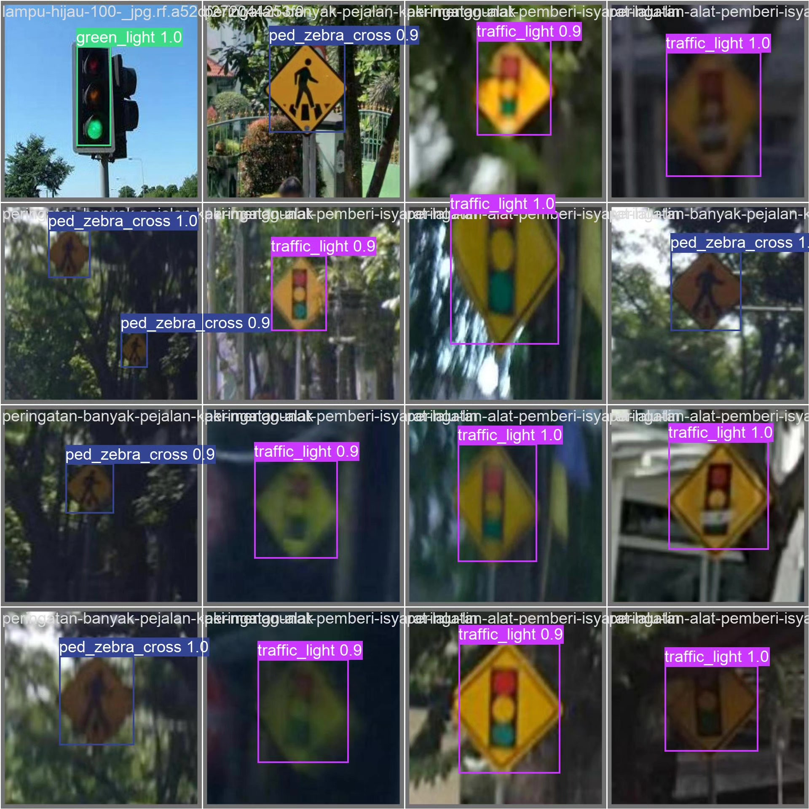
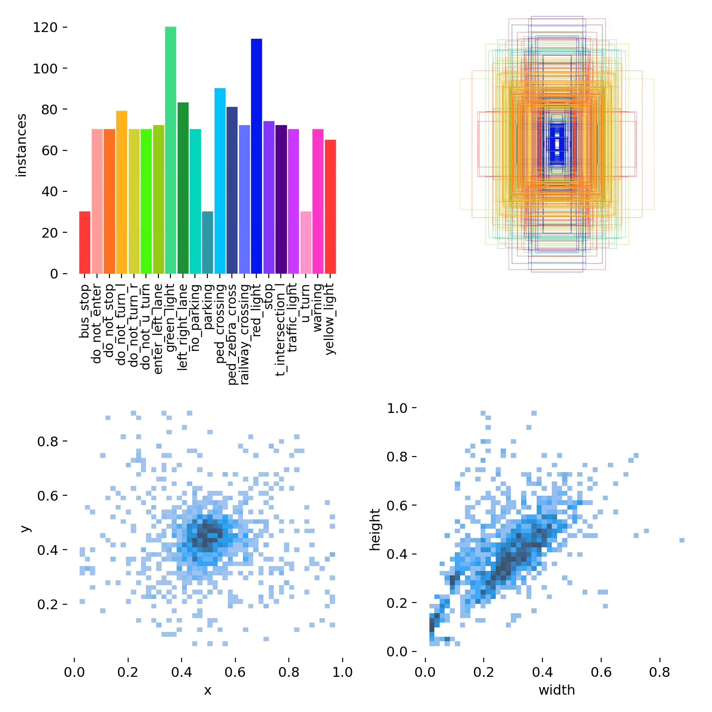
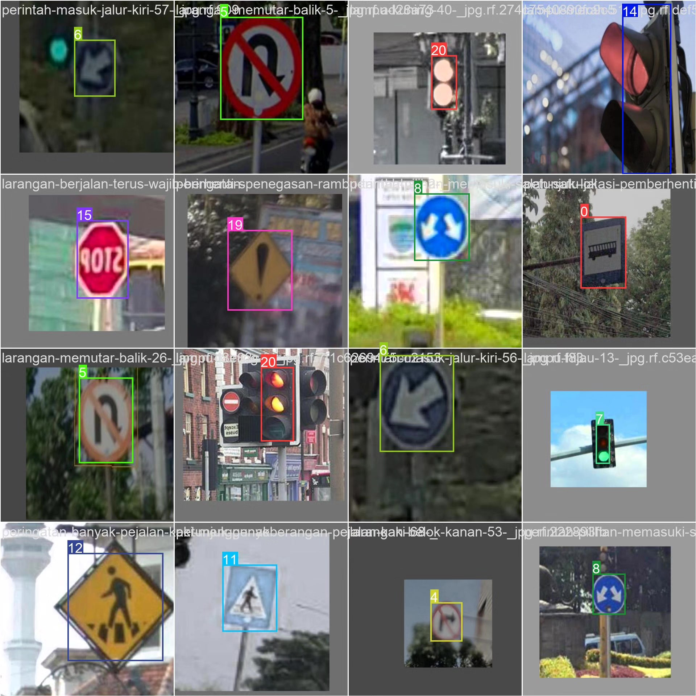

# Road traffic signal detection system based on deep learning YOLOv10

## Body

This project has developed an efficient traffic signal detection system based on the YOLOv10 object detection algorithm, specifically designed to identify 21 different types of road traffic signs and signals. The system was trained and evaluated on a dataset consisting of 1376 training images, 488 validation images, and 229 test images, accurately detecting various road signals such as stop signs, traffic lights, prohibition signs, and warning signs. This system can be applied in areas such as intelligent transportation management, autonomous driving assistance systems, and driver behavior monitoring, providing technical support for improving road safety and traffic efficiency.

The company's products have obtained the official commercial license certification from YOLO.

We offer after-sales service.

After payment, we will provide WeChat IDs for instant questions and answers.

Environmental configuration: A tutorial on environmental configuration will be provided, with WeChat available for Q&A.

Remote installation services: If remote configuration is required, an additional fee of 69 is charged, with all fees refunded if the configuration fails (only the installation fee is refunded for older computers).

Retraining the dataset: After setting up the environment, you can train on your own computer. If you need us to retrain, just pay 69 plus the computing cost (2.5 yuan/hour).

Full after-sales service

## Images

## Payment

Here is a pay link on Stripe ( https://buy.stripe.com/3cs8yP7sY87d0vu9AB ). Please contact me lonlonago@foxmail.com after funding $89, and I will send you a complete data files , thank you!

